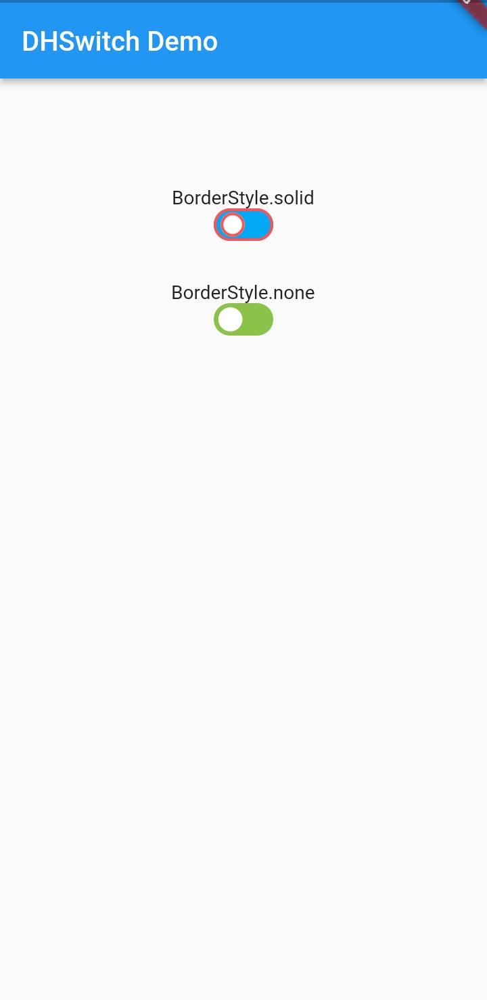

# dh_switch

A Simple Switch package. 

## Getting Started

You can set the thumb and track colors, use `switchSize` to set the `Switch` size, `borderColor` to set the thumb and track border colors, and if you don't need a border, set `borderStyle = BorderStyle.none`.

